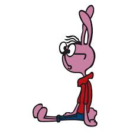

# labrab-03

## Рекурсивые функции

**Динамическое программирование**  

### 1 Задача для разминки

Исполнитель и количество программ  
Решить задачу 11483 с сайта https://kompege.ru/task  

### 2 Кролик и ступеньки  


| Задание на лабораторку | <!-- --> | 
| -------- | -------- |
| Написать 4 программы для решения задачи при разных условиях. Решение оформить в виде рекурсивной функции. |  |

```txt
Есть лестница в n ступенек.  
Кролик сидит перед лестницей на земле.  
За один прыжок кролик может преодолеть вверх:  

задача 1) 1 или 2 ступеньки;
задача 2) 1 или 3 ступеньки;
задача 3) +1 ступеньку или *2 ступеньки или *3 ступеньки
задача 4) k ступенек (это означает от 1-ой до k включительно)

Сколько всего различных маршрутов есть
у кролика с земли до верхней ступеньки?

В задачах 1-3 на вход пользователь подаёт значение n.  
В задаче 4 на вход пользователь подаёт  
через пробел два значения k и n  
```

```txt
Примеры ответов для задачи 4
при заданных входных k и n:
| k | n | ответ
| 1 | 3 | = 1
| 2 | 3 | = 3
| 2 | 4 | = 5
| 2 | 7 | = 21
| 3 | 4 | = 7
| 4 | 9 | = 208

```

---  
